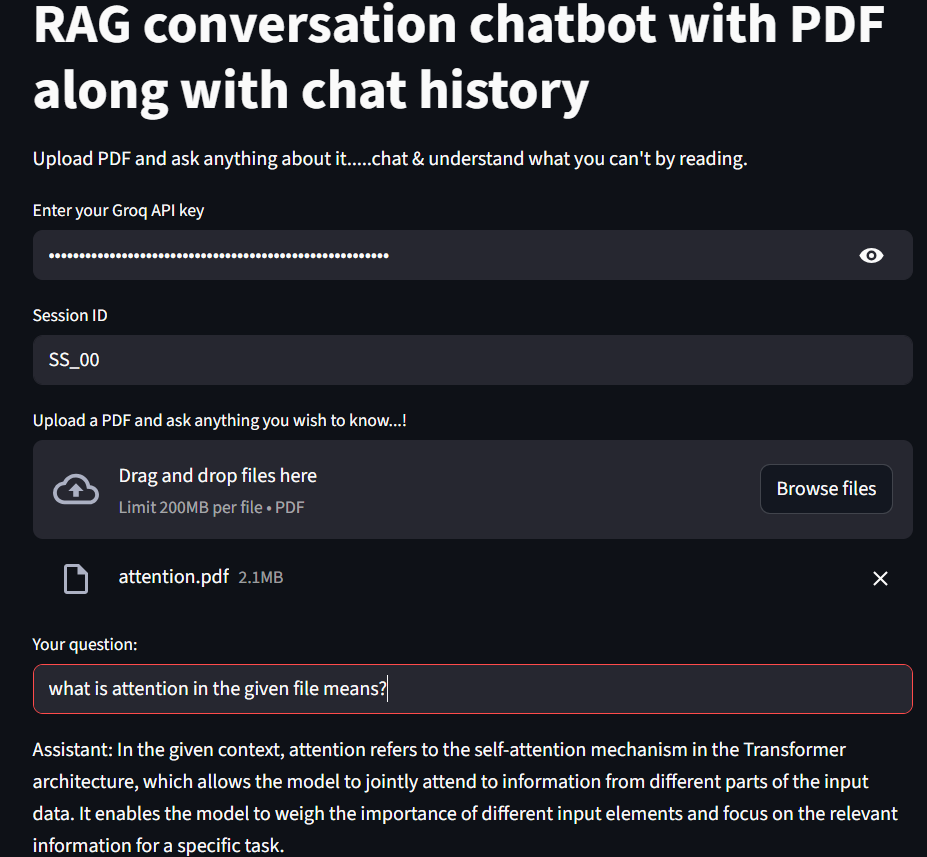

# RAG-PDF-Conversational-Assistant

* Groq LLM (Llama 3.1) and Ollama embeddings were integrated into a Retrieval-Augmented Generation (RAG) pipeline using LangChain to enable context-aware Q&A straight from user-uploaded PDFs.

 * Using RunnableWithMessageHistory and ChatMessageHistory, a multi-session chat memory system was created that allows for persistent, context-aware dialogues between sessions.

 * Using RecursiveCharacterTextSplitter and Chroma vector DB, an interactive Streamlit web application that supports multiple PDF uploads was created for effective text chunking and retrieval.

 * created a two-step RAG workflow in which a contextual QA chain produces succinct, factual responses to user queries that are reformulated by a history-aware retriever.

 * Scalability and smooth interaction with other LLMs, embeddings, and vector stores were guaranteed by the modular layers for ingestion, retrieval, and conversation management that were designed.

 